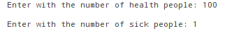
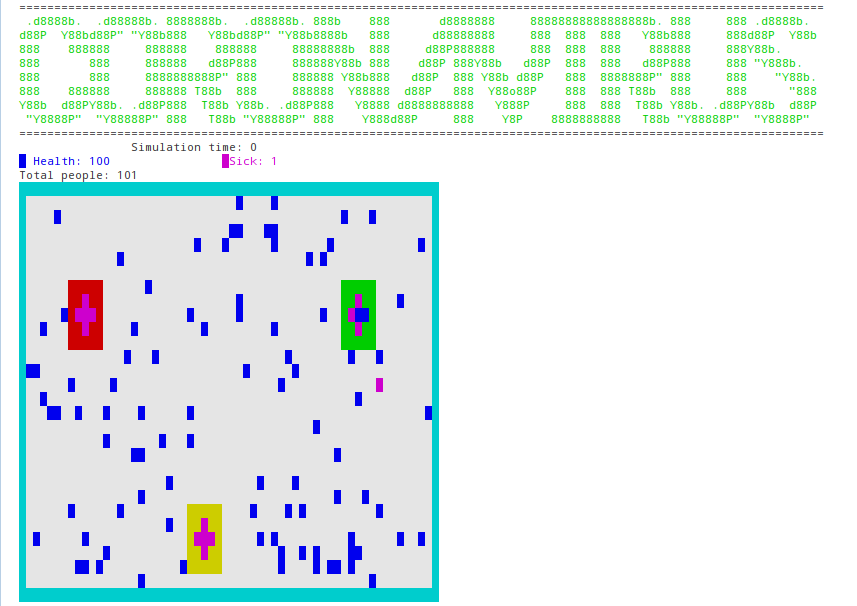

# corona-virus-simulation
This repository is a propagation simulator of corona virus, using colors to represent health peoples and sick peoples that are infected with corona virus, the sick peoples are heal if enter the hospital.

* [Description](#description)
* [How to run](#how-to-run)
* [Simulation](#simulation)
* [Youtube](#youtube)

## Description
In the start of the simulation will be asked to the user the quantity of health and sick people to simulate the corona virus infection, after this the simulation will start.
* **sick people infect health people if they touch health people**
* **sick peopple are cured if the entter in the hospital**
* **sick people die 30 seconds after being infected**

## How to run
 **Run this command in order to execute the project**
 ```sh
 java -jar corona-simulator/dist/corona-simulator.jar
 ```

## Simulation
In the start of the simulation will be asked to the user the quantity of health and sick people to simulate the corona virus infection, After this the simulation will start, the simulation will finish if all sick peoples were cured or all health people were infected or all people died.

**Example of input:**



**Example of simulation:**



## Youtube
[](https://www.youtube.com/watch?v=9SN5liLsy6g "Simulação corona-virus")

## Enjoy the simulation

